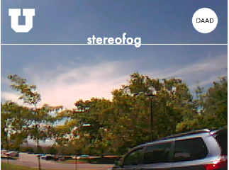
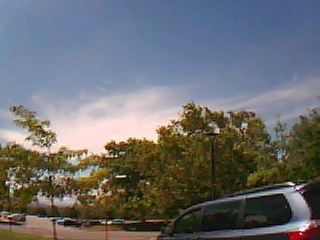
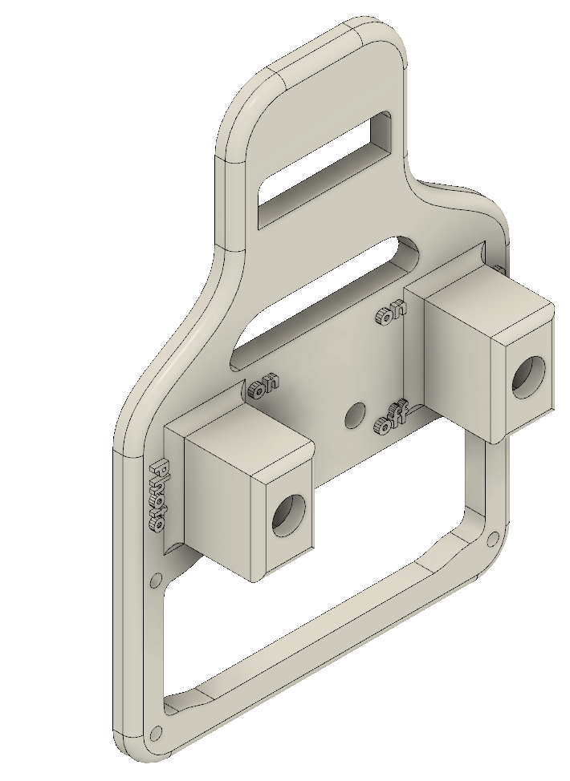
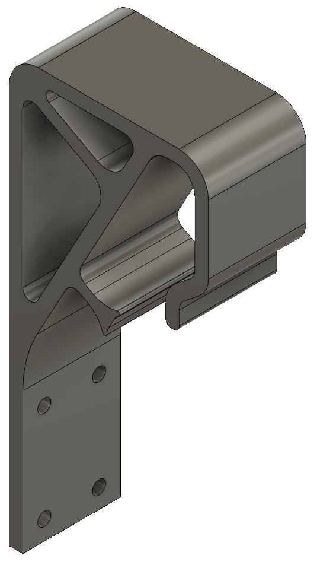
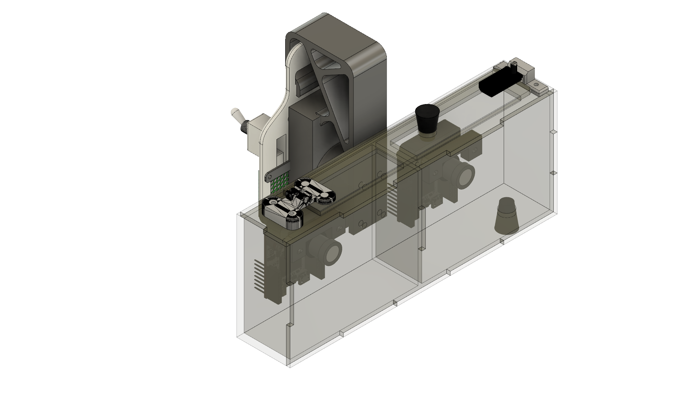
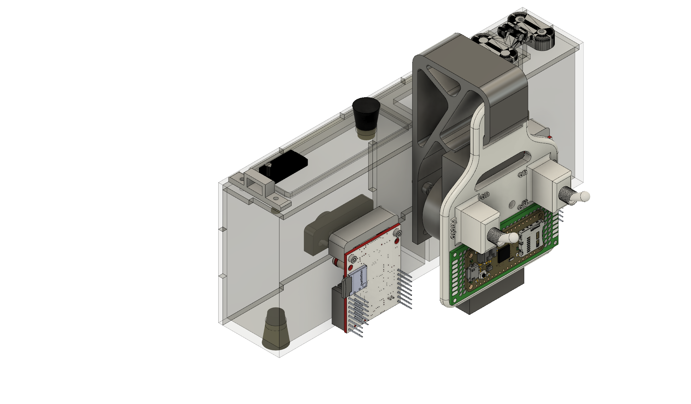
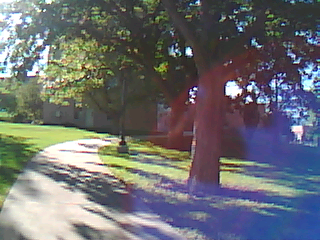
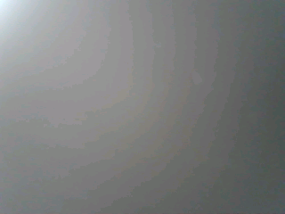

<style>
    /* initialise the counter https://tamarisk.it/automatically-numbering-figures-in-markdown/ */
    body { counter-reset: figureCounter; }
    /* increment the counter for every instance of a figure even if it doesn't have a caption */
    figure { counter-increment: figureCounter; }
    /* prepend the counter to the figcaption content */
    figure figcaption:before {
        content: "Fig " counter(figureCounter) ": "
    }
</style>

# stereofog

<p align="center">

</p>

<p align="center">
<font size = "1"> logo image attributions: <a href="https://commons.wikimedia.org/wiki/File:Utah_Utes_-_U_logo.svg">U of U</a> | <a href="https://commons.wikimedia.org/wiki/File:Deutscher_Akademischer_Austauschdienst_logo.svg">DAAD</a></font>
</p>

This repository documents a research project carried out at the [Laboratory for Optical Nanotechnologies](https://nanoptics.wordpress.com) at the University of Utah under supervision of [Prof. Rajesh Menon](https://faculty.utah.edu/u0676529-Rajesh_Menon/research/index.hml) in Summer (July-September) 2023. It was funded as part of the [RISE program](https://www.daad.de/rise/en/) by the [German Academic Exchange Service (Deutscher Akademischer Austauschdienst (DAAD))](https://en.wikipedia.org/wiki/German_Academic_Exchange_Service).

*potentially add some cool gifs here*
*insert preliminary results, logos, images, etc. as teaser here*


 fogged image  |  real image  |   synthetic image 
:-------------------------:|:-------------------------:|:-------------------------:
 |   | 


## Table of Contents
- [stereofog](#stereofog)
  - [Table of Contents](#table-of-contents)
  - [Goal](#goal)
  - [Potential applications](#potential-applications)
  - [Project timeline](#project-timeline)
  - [Image capturing device](#image-capturing-device)
    - [Requirements](#requirements)
    - [Cameras](#cameras)
    - [Image trigger](#image-trigger)
    - [Wiring \& Programming](#wiring--programming)
    - [Gimbal](#gimbal)
    - [Case](#case)
    - [Bla?](#bla)
  - [Python environment](#python-environment)
  - [Synthetic data](#synthetic-data)
    - [Foggy Cityscapes from Uni Tübingen](#foggy-cityscapes-from-uni-tübingen)
    - [Foggy Cityscapes from ETH Zürich](#foggy-cityscapes-from-eth-zürich)
    - [Foggy Carla from Uni Tübingen](#foggy-carla-from-uni-tübingen)
    - [Foggy KITTI from Uni Tübingen (?)](#foggy-kitti-from-uni-tübingen-)
  - [Collected dataset](#collected-dataset)
  - [pix2pix on dataset](#pix2pix-on-dataset)


## Goal
This project had three objectives:

1. build a device capable of capturing paired images that depict the same scenery, one image with fog and the other without
2. collect a dataset of paired images
3. apply the [pix2pix model](https://phillipi.github.io/pix2pix/) developed at the University of California, Berkeley to the translation problem **fog &rarr; no fog**

## Potential applications

* Autonomous driving
* Search & rescue (wildfires, home fires, etc.)
* Military

## Project timeline
*Description of project timeline here*


<figcaption align = "center"><b>Project timeline</b></figcaption>


## Image capturing device
### Requirements

The device had to be able to:
* accomodate two cameras
* isolate the cameras from each other
* provide a fog chamber for one of the cameras
* trigger both cameras at the same time

The shift in perspective hailing from the distance the two cameras are set apart will be ignored. The further away the photographed scenes are, the less this will have an effect on the resulting images.

### Cameras
The two identical cameras used for this project had to be:

* programmable
* able to interface with other devices
* small & lightweight
* low power

Therefore, we chose to use the [OpenMV](https://openmv.io) [H7](https://openmv.io/collections/products/products/openmv-cam-h7) cameras for the task. The [OpenMV IDE](https://openmv.io/pages/download) makes it easy to program the camera using `python`. They are able to receive input from their I/O pins as well as output user feedback using their LEDs.

<p align="center">

<figcaption align = "center"><b>OpenMV H7 camera</b></figcaption>
</p>

### Image trigger
In order to get exactly paired images from both cameras that are captured at the same time, it is necessary to introduce a common trigger. We used a lightweight Arduino board for this task. Any Arduino board should be capable of sending this trigger, but we used an [Adafruit Feather 32u4 Radio](https://learn.adafruit.com/adafruit-feather-32u4-radio-with-rfm69hcw-module) that was available from an earlier project.

<p align="center">

<figcaption align = "center"><b>Adafruit Feather 32u4 Radio board</b></figcaption>

</p>

The board is connected to both cameras and sends a trigger signal to both cameras at the same time. The cameras are programmed to capture an image when they receive the trigger signal.

### Wiring & Programming
<p align="center">

<figcaption align = "center"><b>Schematics for the fog device</b></figcaption>

</p>

**Image Attributions**:
[Switches](https://www.autobotic.com.my/Button-Switch/3-Pin-SPDT-Toggle-Switch-ON-OFF-ON) |
[Breadboard](https://magpi.raspberrypi.com/articles/breadboard-tutorial) |
[Adafruit Feather board](https://learn.adafruit.com/adafruit-feather-32u4-basic-proto/pinouts) |
[OpenMV camera](http://wiki.amperka.ru/_media/products:openmv-cam-h7:openmv-cam-h7-pinout.pdf)

Above is the wiring diagram for the project. Two switches are used to trigger both photos as well as videos. The photo trigger switch is connected to the Arduino board. It detects the state of the pin the switch is connected to and starts the recording loop. This means it sends a trigger signal to the cameras every second, as long as the switch is activated. At the same time, the onboard LED indicates this by blinking:

```arduino
  if (trigger_switch_value == LOW) {
    digitalWrite(LED_BUILTIN, HIGH);
    digitalWrite(TOGGLE_PIN, HIGH);
    delay(650);
    digitalWrite(TOGGLE_PIN, LOW);
    digitalWrite(LED_BUILTIN, LOW);
    delay(650);
  }
```

The total delay of 1.3s was necessary in order to leave the cameras with enough time to process the images. They were equipped with microSD cards with slightly different specifications, and below this threshold, the camera with the slower card would skip an image after a few frames, since it was still processing the previous image.
<p align="center">

<figcaption align = "center"><b>The lower performance microSD card used for one of the cameras</b></figcaption>
</p>

The entire Arduino code can be found in the [Arduino script](arduino/fog_device_trigger.ino).
In addition, the Arduino board is used to pass the 5V power supplied using a USB cable and a powerbank to the cameras.

The video trigger switch is connected directly to the cameras in order to avoid overhead introduced by the Arduino board.

Both OpenMV cameras are equipped with the exact same `python` code that listens to the two pins at which the input signals arrive. In case a video trigger signal is detected, the cameras instantly start recording a video. The video is stopped when the switch returns to the off position. The video is then saved to the microSD card as an `.mjpeg` file, numbered sequentially:

```python
# Loop forever
while(True):

    if mode_pin.value() == 1:

        blue_led.on()

        m = mjpeg.Mjpeg("recorded_videos/"+ str(video_counter) + ".mjpeg")

        while mode_pin.value() == 1:
            clock.tick()
            m.add_frame(sensor.snapshot())
            #print(clock.fps())

        m.close(clock.fps())
        blue_led.off()

        video_counter += 1
```

In case no input signal is detected at the video trigger, the cameras listen to the photo trigger. When a signal is detected there, they capture an image, label it sequentially, save it to the microSD card and then wait for the current trigger signal to go away, as to avoid capturing multiple images on one trigger:

```python
    else:
        # collect image if GPIO pin detects a HIGH signal
        if pin.value() == 1:


                img = sensor.snapshot()

                # toggle green LED after recording image to provide positive user feedback
                green_led.on()
                time.sleep_ms(100)
                green_led.off()

                # Saving the image
                img.save('/recorded_images/' + str(counter))
                counter += 1

                # Stop continuing until the pin value has gone to low again
                while pin.value() == 1:
                    pass # do nothing to wait for the trigger going away, to make sure only one image is collected per trigger
```

The entire `python` code for the cameras can be found in the respective [script](openmv/read_external_trigger.py).

### Gimbal

<p align="center">

<figcaption align = "center"><b>Gimbal model used in this project</b></figcaption>
</p>

In order to stabilize the images while walking and ensure they are approximately level, a gimbal was used to hold the entire device. The gimbal used for this project was the [Hohem iSteady Q](https://store.hohem.com/products/isteady-q). It is a lightweight single-axis gimbal that is able to hold a smartphone.

### Case

In order to be able to capture approximately the same image, the cameras had to be mounted as close together as possible. Simultaneously, the case must be able to hold the fog surrounding one camera while isolating the other camera from the influence of the fog, keeping all other conditions the same.

Therefore, both cameras are arranged side by side, inside separate chambers. The setup of the initial prototype put the box with the two cameras far above axis of rotation of the gimbal. The resulting torque to keep the construction level was too high in this configuration, causing the gimbal to shut off regularly.

<p align="center">

<figcaption align = "center"><b>The gimbal failing to keep the first prototype level</b></figcaption>
</p>


The case was designed in [Fusion 360](https://www.autodesk.com/products/fusion-360/overview). Some 3D printed files were printed using a [Creality Ender 3 Pro](https://www.creality3dofficial.com/products/ender-3-pro-3d-printer), some on an [Ultimaker S3](https://ultimaker.com/3d-printers/ultimaker-s3). The front plate was lasercut on a CO<sub>2</sub> laser cutter.

<p align="center">

<figcaption align = "center"><b>CAD design of the gimbal mount</b></figcaption>
</p>
<p align="center">

<figcaption align = "center"><b>CAD design of the gimbal bridge</b></figcaption>

</p>
<p align="center">

<figcaption align = "center"><b>Front view of entire CAD design</b></figcaption>
</p>

<p align="center">

<figcaption align = "center"><b>Rear view of entire CAD design</b></figcaption>
</p>

### CAD file attributions

Several parts of the CAD model were adopted from different sources. They are attributed in the following:

<p align="center">

Part | Source | License
--- | --- | ---
OpenMV camera | [GrabCAD](https://grabcad.com/library/openmv-cam-h7-1/details?folder_id=7042713) | [unknown](https://en.wikipedia.org/wiki/Rick_Astley)
Adafruit Feather board | [Adafruit](https://github.com/adafruit/Adafruit_CAD_Parts/blob/main/2795%20Feather%2032u4%20Adalogger/2795%20Feather%2032u4%20Adalogger.step) | [MIT](https://opensource.org/license/mit/)
Prototyping board | [GrabCAD](https://grabcad.com/library/universal_board_30x70mm-1) | [unknown](https://en.wikipedia.org/wiki/Rick_Astley)
Toggle switch | [GrabCAD](https://grabcad.com/library/toggle-switch-37) | [unknown](https://en.wikipedia.org/wiki/Rick_Astley)
DIN912 M3 25mm screw | [3Dfindit](https://www.3dfindit.com/en/digitaltwin/hexagon-socket-head-cap-screws?path=fabory%2F2_socket_products_and_set_screws%2Fdin_912.prj&mident=%7Bfabory%2F2_socket_products_and_set_screws%2Fdin_912.prj%7D%2C016+%7BLINEID%3D50640%7D++%7BNB%3DZylinderschraube+DIN+912+M2x25+55050.020.025%28High%29%7D%2C%7BCNSORDERNO%3D55050.020.025%7D%2C%7BNENNID%3DM2X25%7D%2C%7BD%3D2.0%7D%2C%7BL%3D25.0%7D%2C%7BBRAND%3DFabory%7D%2C%7BSTANDARD%3DDIN+912%7D%2C%7BTHREAD%3DMetric+thread%7D%2C%7BTHREADDIRECTIO%3DRight%7D%2C%7BSTYLE%3D%7D%2C%7BTYPE%3DSocket+cap+screw%7D%2C%7BBASICMATERIAL%3DStainless+steel%7D%2C%7BGRADE%3DA4-70%7D%2C%7BSURFACETREATME%3D%7D%2C%7BHEADSHAPE%3DCylindrical+head%7D%2C%7BDRIVINGFFEATURE%3DHexagon+socket%7D%2C%7BCOLOR%3D%7D%2C%7BCOMPARABLESTAN%3DISO4762%2CASMEB18.3.1M%2CBS4168-1%2CNEN1241%2CNFE25-125%7D%2C%7BADDITIONALINFO%3D%7D%2C%7BROHS%3DY%7D%2C%7BAPPROVAL%3D%7D%2C%7BEANCODE%3D8715494620321%7D%2C%7BINTRASTATCODE%3D73181562%7D%2C%7BECLASS%3D23-11-06-27%7D%2C%7BUNSPSC%3D31161605%7D%2C%7BETIM%3DEC002356%7D%2C%7BPACKAGING%3D500%7D%2C%7BTL%3D0.000%7D%2C%7BVARIANT%3D1%7D%2C%7BFAB_NENN%3DM2x25%7D%2C%7BFAB_GEO%3Db%3D16%3Bd%3DM2%3Bdk+%28max.%29%3D3.8%3BFull+thread+L+%3F%3D20%3Bk+%28max.%29%3D2%3BLength+%28L%29%3D25%3BP%3D0.4%3Bs%3D1.5%7D%2C%7BFAB_ARTICLENUMBER%3D%7D%2C%7BFABNETWEIGHT%3D0.001%7D%2C%7BGEWINDE%3D0%7D%2C%7BP%3D0.400%7D%2C%7BBX%3D16.000%7D%2C%7BDK%3D3.800%7D%2C%7BDA%3D2.600%7D%2C%7BDS%3D2.000%7D%2C%7BE%3D1.730%7D%2C%7BF%3D0.510%7D%2C%7BK%3D2.000%7D%2C%7BR%3D0.100%7D%2C%7BS%3D1.500%7D%2C%7BT%3D1.000%7D%2C%7BV%3D0.200%7D%2C%7BDW%3D3.480%7D%2C%7BW%3D0.550%7D%2C%7BCNSAVOID%3D0%7D%2C%7BLOD%3DHigh%7D%2C%7BSTANDARDSMALL%3Ddin_912.png%7D) | [unknown](https://en.wikipedia.org/wiki/Rick_Astley)
</p>

## Python environment

All code was run on Python `3.9.7` with the following packages installed:

- `numpy`
- `opencv-python`
- `matplotlib`
- `torch`
- ...

The packages are listed in the `requirements.txt` and can be installed with:
```bash
pip install -r requirements.txt
```

For the training of the pix2pix model, CUDA acceleration was used.

*Python version, requirements.txt, CUDA acceleration, etc.*

## Getting started
*descriptions on how to get up and running*

## Training

The models were trained on a lab computer equipped with a dedicated GPU (NVIDIA GeForce GTX 970) and 64 GB of RAM.

All models were trained for the default 200 epochs for the pix2pix model. The training time increased along with the size of the dataset. For the final model, the training time was around 20 hours.

## Synthetic data
At the beginning of the project, we experimented with synthetic datasets in combination with the pix2pix model. The datasets used were based on the [Cityscapes dataset](https://www.cityscapes-dataset.com/) as well as on images derived from the [CARLA simulator](https://carla.org/).
The fog simulations generally work either by directly using a depth map that is available for each particular image, or by using the left and right images to calculate the depths in the images, thus reconstructing this depth map. This depth map helps in estimating how strongly the fog affects different parts of the image.

### Semi-synthetic datasets
The datasets in the following are semi-synthetic, meaning that they work with real images, to which the fog has been added synthetically. A disadvantage of this method is that the depth map is never perfect, which can lead to artifacts in the fogged images.

#### Foggy Cityscapes from Uni Tübingen
In cooperation with the researchers [Georg Volk](https://www.embedded.uni-tuebingen.de/en/team/georg-volk/) and  for the University of Tübingen, Germany, we trained a model on synthetic data generated for their paper ["Simulating Photo-realistic Snow and Fog on Existing Images for Enhanced CNN Training and Evaluation"](https://embedded.uni-tuebingen.de/assets/publications/vonBernuth-Volk-Bringmann_Snow_Fog.pdf).

#### Foggy Cityscapes from ETH Zürich
Another dataset taken into consideration was the [Foggy Cityscapes dataset](http://people.ee.ethz.ch/~csakarid/SFSU_synthetic/) from the paper ["Semantic Foggy Scene Understanding with Synthetic Data"](http://people.ee.ethz.ch/~csakarid/SFSU_synthetic/Semantic_foggy_scene_understanding_with_synthetic_data-Sakaridis+Dai+Van_Gool-IJCV-AAM.pdf) by [Sakaridis et al.](https://people.ee.ethz.ch/~csakarid/). The dataset was created by the [Computer Vision Lab](https://www.vision.ee.ethz.ch/en/) of ETH Zürich, Switzerland.

### Fully synthetic datasets
The following dataset was created entirely synthetically. The original images were rendered using a driving simulator, which generated the matching perfect depth maps as well. This way, the fogged images do not show any artifacts.

#### Foggy Carla from Uni Tübingen


### Foggy KITTI from Uni Tübingen (?)
tbd

## Collected dataset

*description & details of the collected dataset*
## pix2pix on dataset

*ML results on dataset*

## Limitations
### Overexposure

Looking through the images in the dataset, you will notice that it was mostly avoided to face the camera directly at the sun (which was shining almost every day in the [hot and dry summer of Salt Lake City](https://en.wikipedia.org/wiki/Climate_of_Salt_Lake_City)). This was due to a limitation of the [OpenMV H7 cameras](https://openmv.io/products/openmv-cam-h7) used to capture the images. Their dynamic range is limited and they tend to be unable to resolve the high dynamic range when facing the sun directly.

<p align="center">

original | fogged
:-------------------------:|:-------------------------:
 | 
</p>

The cameras were used in spite of this issue because of their advantages in programmability, connectivity and compactness.

### Weather conditions

As just mentioned, the images show almost exclusively sunny scenes. This is due to them being collected during August, which is the clearest month of the year in Salt Lake City, with [the sky being clear around 78% of the time](https://weatherspark.com/y/2706/Average-Weather-in-Salt-Lake-City-Utah-United-States-Year-Round). The few times it was raining, the camera was not used to avoid damage to the electronics.


# References

* [1]: